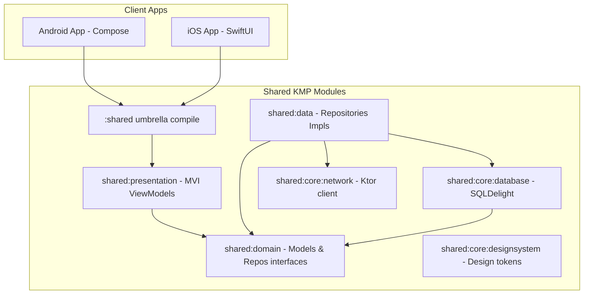

# CineVerse 🎬

CineVerse is a modern, cross-platform Movie Tracker application built using **Kotlin Multiplatform (KMP)**. It shares core logic, networking, caching, and state-machine presentations across platforms, while implementing native, optimized UIs in **Jetpack Compose** (Android) and **SwiftUI** (iOS).

---

## 🚀 Key Features

*   **First-Launch Onboarding**: A beautiful 3-page swipable introduction highlighting core features.
*   **Mandatory Authentication Gate**: Local simulation login and signup, verifying session states via cache.
*   **Auto-Scrolling Carousel**: Immersive home screen banners that automatically loop with smooth overlay animations.
*   **Interactive 3D-Dice Movie Randomizer**: Custom canvas dice that rotates in 3D to randomly recommend top-rated movies.
*   **Smart Reminders**: Schedule localized notifications (uses Android's `AlarmManager` and iOS's `UserNotifications` framework) to remind you when a movie releases.
*   **Multi-Modular Android Feature Architecture**: Features are split into individual modules (`:features:home`, `:features:dice`, etc.) for fast compilation and clean separations.

---

## 🛠 Tech Stack & Targets

| Target / Component | Framework / Library |
| :--- | :--- |
| **Android UI** | Jetpack Compose |
| **iOS UI** | SwiftUI |
| **Concurrency** | Kotlin Coroutines & Flow (via SKIE for Swift Async Sequences) |
| **Local Database** | SQLDelight with platform-specific SQLite drivers |
| **Network Client** | Ktor Client with ContentNegotiation (Kotlinx Serialization) |
| **Dependency Injection** | Koin |
| **Project Gen (iOS)** | XcodeGen |

---

## 📁 Architecture Overview

CineVerse is built following **Clean Architecture** principles:



---

## 🏃 How to Run the Project

### Prerequisites

Ensure you have the following installed on your machine:
*   **macOS** (For iOS compilation)
*   **Xcode** (v15.0 or later)
*   **XcodeGen** (`brew install xcodegen`)
*   **Android Studio** (Koala or later)
*   **Java JDK 17** (or the bundled Jetpack runtime)

---

### 🤖 Running the Android Application

1.  **Open in Android Studio**:
    *   Open Android Studio.
    *   Choose **Open** and select the `/Users/clovn/AndroidStudioProjects/CineVerse` folder.
2.  **Configure JDK Runtime**:
    *   Go to **Settings/Preferences** ➔ **Build, Execution, Deployment** ➔ **Build Tools** ➔ **Gradle**.
    *   Set **Gradle JDK** to use the bundled Java runtime from Android Studio (JBR).
3.  **Sync Gradle**:
    *   Click **Sync Project with Gradle Files** and wait for dependencies to resolve.
4.  **Run Application**:
    *   Select the `:androidApp:app` run configuration.
    *   Choose your emulator or connected device and click **Run (Run button)**.

---

### 🍏 Running the iOS Application

The iOS project uses **XcodeGen** to manage project settings dynamically, avoiding git conflicts.

1.  **Regenerate Xcode Project**:
    Navigate to the project root and run XcodeGen in the terminal:
    ```bash
    xcodegen generate
    ```
2.  **Open in Xcode**:
    Open the generated workspace file:
    ```bash
    open iosApp.xcodeproj
    ```
3.  **Select Target and Device**:
    *   Choose the `iosApp` scheme.
    *   Select an iOS Simulator (e.g. iPhone 15/16).
4.  **Build and Run**:
    *   Press `⌘R` or click the **Play** button.
    *   Xcode will execute the build phase script compiling the KMP shared framework (`:shared:embedAndSignAppleFrameworkForXcode`) and launching the SwiftUI app in the simulator.

---

## 📝 CLI Commands (From Terminal)

To compile targets or check build health from your terminal:

*   **Build Android Debug APK**:
    ```bash
    ./gradlew :androidApp:app:assembleDebug
    ```
*   **Compile Kotlin Multiplatform Core**:
    ```bash
    ./gradlew :shared:assembleDebug
    ```
*   **Build iOS Target from Terminal**:
    ```bash
    xcodebuild -project iosApp.xcodeproj -scheme iosApp -sdk iphonesimulator -configuration Debug
    ```
