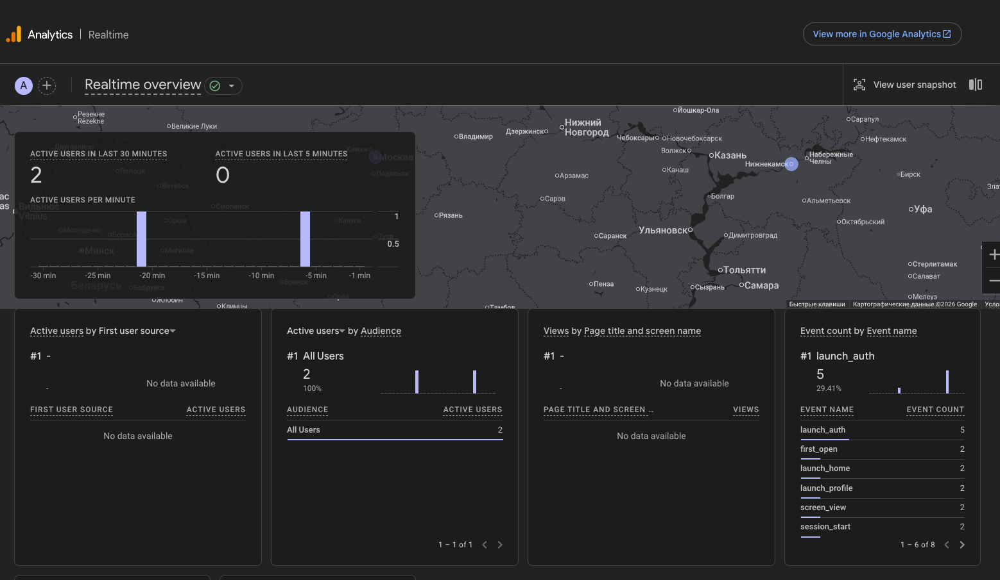
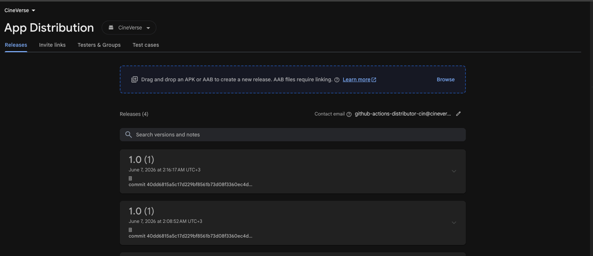

# CineVerse 🎬

> Developed by **Халиуллин Айрат** & **Гумеров Нияз**

---

## 🛠️ Before build&launch 

> [!IMPORTANT]
> Перед запуском добавить API-ключ сюда:
> 🔑 **[TmdbConfig](shared/core/network/src/commonMain/kotlin/com/cineverse/core/network/TmdbConfig.kt)**

---

## 📂 Info & Demo

Все демонстрационные материалы и скринкасты находятся в папке [demo/](demo).

### 🎥 Screencasts

* 🤖 **Android:** [androidScreenCast.mp4](demo/androidScreenCast.mp4)
* 🍎 **iOS:** [iosScreencast.mov](demo/iosScreencast.mov)

### 📊 Screenshots & Analytics

<table width="100%">
  <tr>
    <td width="50%" align="center">
      <b>📈 Analytics</b> 
      
    </td>
    <td width="50%" align="center">
      <b>🚀 App Distribution</b> 
      
    </td>
  </tr>
</table>
